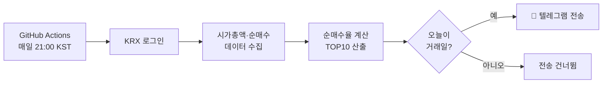

# 📊 코스피·코스닥 순매수율 자동 알림

> 한국거래소(KRX) 데이터를 매일 자동으로 수집해, **사모펀드·외국인의 시가총액 대비 순매수율 TOP10**을 계산하고 텔레그램으로 전송하는 개인 투자 보조 자동화 프로젝트입니다.

매일 장 마감 후 KRX 홈페이지에서 6개 파일을 손으로 내려받아 분석하던 반복 작업을, **실행 없이도 알아서 도는** 서버리스 자동화로 바꾼 프로젝트입니다.

---

## ✨ 주요 기능

- 🔐 **KRX 정보데이터시스템 자동 로그인** 후 데이터 수집 (시가총액 · 투자자별 순매수)
- 🧮 **순매수율 계산** — `순매수 거래대금 ÷ 시가총액 × 100`, 시장(코스피/코스닥) × 투자자(사모펀드/외국인)별 **TOP10** 산출
- ⏰ **매 거래일 21:00(KST) 자동 전송** — GitHub Actions cron 기반, 무중단 운영
- 📅 **거래일 자동 판별** — 주말·공휴일에는 전송하지 않음
- 📲 **텔레그램 봇 알림** — 결과를 채팅으로 바로 확인

## 🛠 기술 스택

| 분류 | 사용 기술 |
|---|---|
| 언어 | Python 3.12 |
| 데이터 | KRX 정보데이터시스템, `requests` |
| 자동화 | GitHub Actions (cron 스케줄 · Secrets) |
| 알림 | Telegram Bot API |
| 시간 처리 | `zoneinfo` (UTC ↔ KST) |

## 🔄 동작 구조



## 💡 기술적으로 해결한 점

- **로그인·안티봇으로 막힌 데이터 접근 자동화** — KRX가 미로그인 요청을 차단(`LOGOUT`)하는 구조를 세션·로그인 흐름 분석으로 우회하여, 계정 로그인 후 데이터를 안정적으로 수집하도록 구현
- **클라우드-현지 시차 문제 해결** — 서버(UTC)와 한국 장 시간(KST)의 9시간 차이를 `zoneinfo`로 정확히 계산해, 거래일 판별과 스케줄이 어긋나지 않도록 처리
- **보안 분리** — 로그인 정보·봇 토큰 등 민감 정보를 코드에서 완전히 분리하여 **GitHub Secrets**로 관리
- **서버리스 무중단 운영** — 별도 서버·비용 없이 GitHub Actions만으로 24/7 자동 실행

## ⚙️ 실행 방법

```bash
pip install -r requirements.txt
python krx_alert_cloud.py
```

필요한 환경변수 (GitHub에서는 Secrets로 설정):

| 이름 | 설명 |
|---|---|
| `KRX_ID` / `KRX_PW` | KRX 정보데이터시스템 로그인 정보 |
| `TELEGRAM_TOKEN` | 텔레그램 봇 토큰 |
| `CHAT_ID` | 전송할 텔레그램 채팅/그룹 ID |

> 자동 실행은 [`.github/workflows/krx.yml`](.github/workflows/krx.yml)에서 매주 월~금 12:00 UTC(= 21:00 KST)에 동작합니다.

---

*본 프로젝트는 개인 학습 및 투자 참고용으로 제작되었으며, 데이터 출처는 KRX 정보데이터시스템입니다.*
